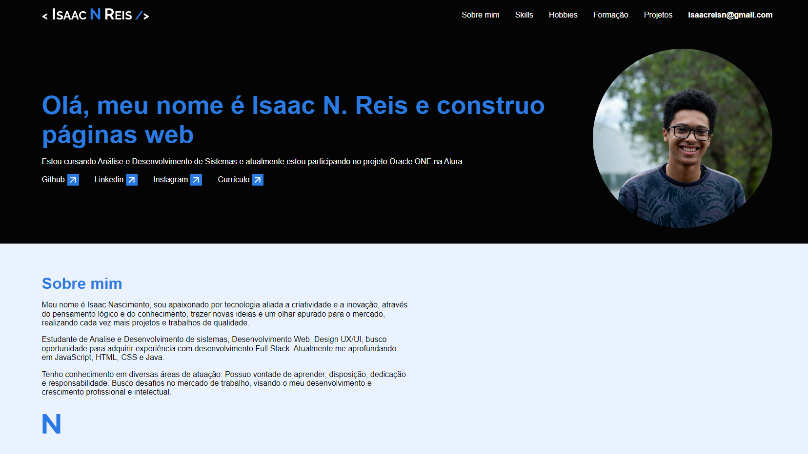

<h1 align="center">
  💻 Portfólio - Isaac N. Reis
</h1>

<h4 align="center"><a href="https://isaacnreis.github.io/Portf-lio/">Clique para visitar o projeto</a></h4>

---

## 📚 Seções

- **Sobre Mim** 
- **Skills** 
- **Hobbies** 
- **Formação** 
- **Projetos** 

---
### 🎨 Modelo Figma: <a href="https://www.figma.com/file/vSJMJmZy75RdHfkF2nteFy/Challenge-Front-end-Portf%C3%B3lio-(Copy)?node-id=0-1&t=cCpp9XTU3Yq35Lv5-0">Link</a>

---